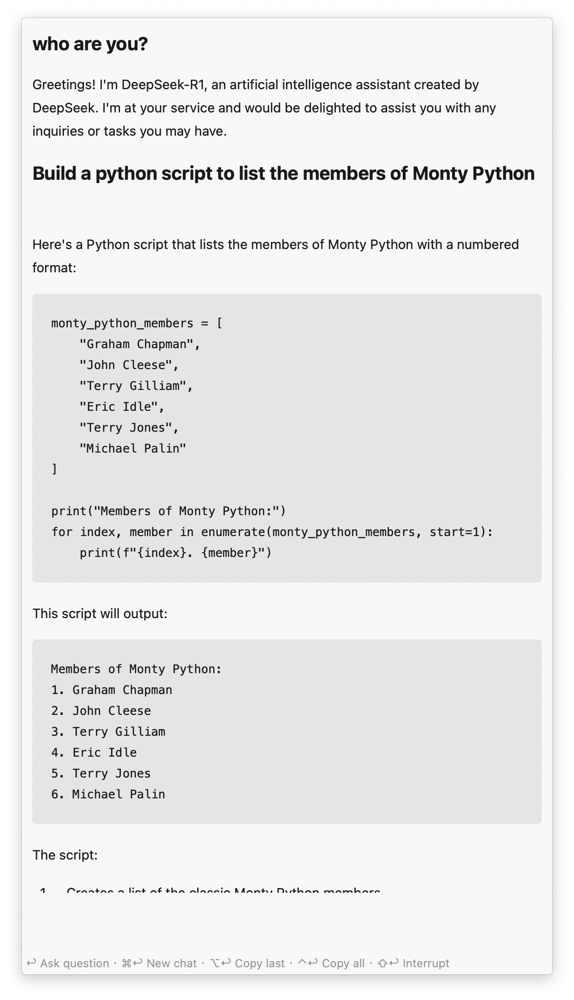

# AlfredWorkflow-DeepSeek

DeepSeek 的 Alfred Workflow（Alfred 工作流 / 插件）。灵感来源于 [官方 ChatGPT Workflow](https://alfred.app/workflows/alfredapp/openai/)。

## 配置步骤

1. 创建 [DeepSeek 账户](https://platform.deepseek.com/)并登录
2. 进入 [API 密钥页面](https://platform.deepseek.com/api_keys)，点击 `+ 创建新密钥`
3. 命名密钥后点击 `创建密钥`
4. 复制密钥并添加到 [工作流配置](https://www.alfredapp.com/help/workflows/user-configuration/)

注：若使用 [腾讯云版 API](https://cloud.tencent.com/document/product/1772/115969)，请选择正确的模型版本。

## 使用指南

### DeekSeek 核心功能

通过以下方式调用：

- 关键词 `deekseek`

- [全局动作](https://www.alfredapp.com/help/features/universal-actions/)

- [备用搜索](https://www.alfredapp.com/help/features/default-results/fallback-searches/)

  

* <kbd>↩</kbd> 新提问
* <kbd>⌘</kbd>+<kbd>↩</kbd> 清空并开启新会话
* <kbd>⌥</kbd>+<kbd>↩</kbd> 复制最后回复
* <kbd>⌃</kbd>+<kbd>↩</kbd> 复制完整对话
* <kbd>⇧</kbd>+<kbd>↩</kbd> 停止生成回复

#### 对话历史管理

在 `chatgpt` 关键词界面使用 ⌥↩ 查看历史记录，每条记录显示首问为标题，末问为副标题

* <kbd>↩</kbd> 归档当前会话并加载选中记录
* 通过 `Delete` [全局动作](https://www.alfredapp.com/help/features/universal-actions/) 删除旧记录
* 使用 [文件缓冲区](https://www.alfredapp.com/help/features/file-search/#file-buffer) 批量选择多个记录
